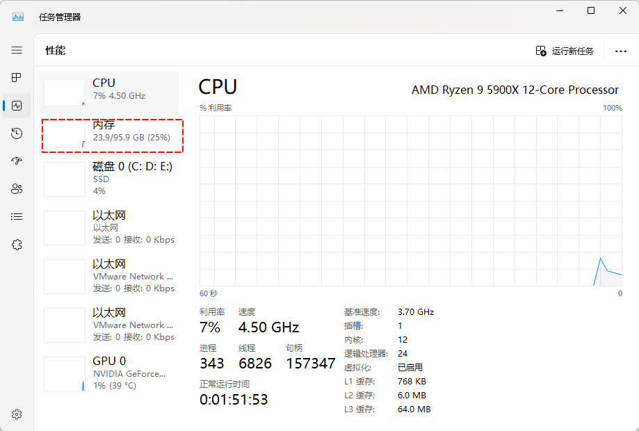
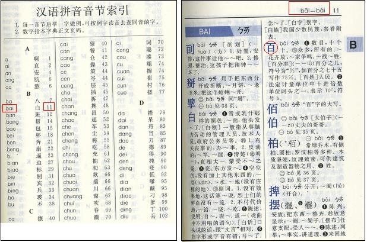
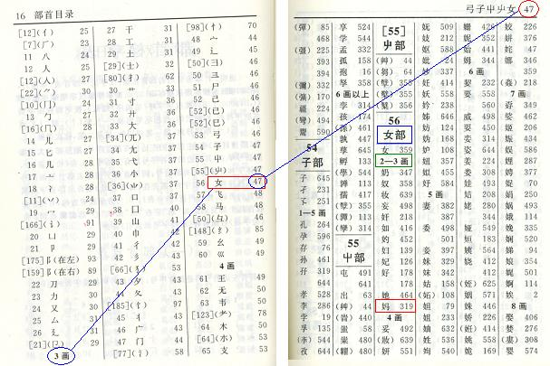
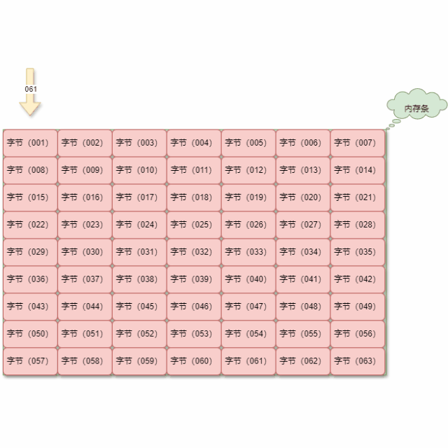
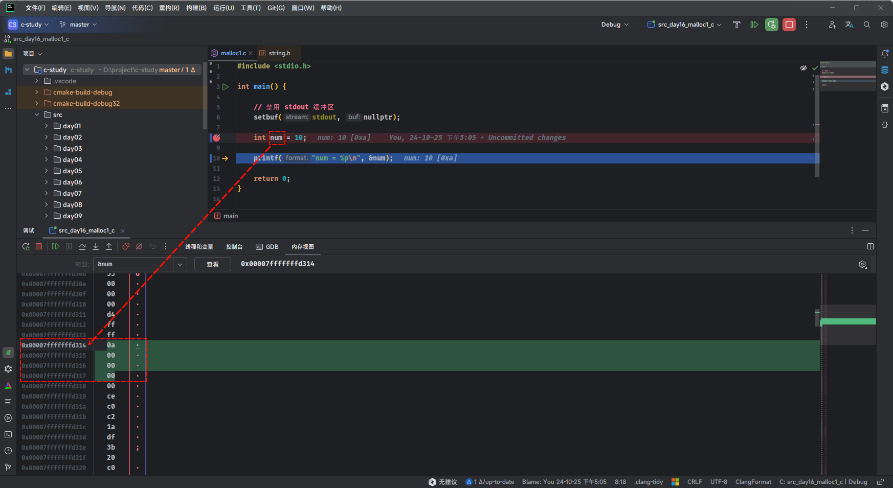
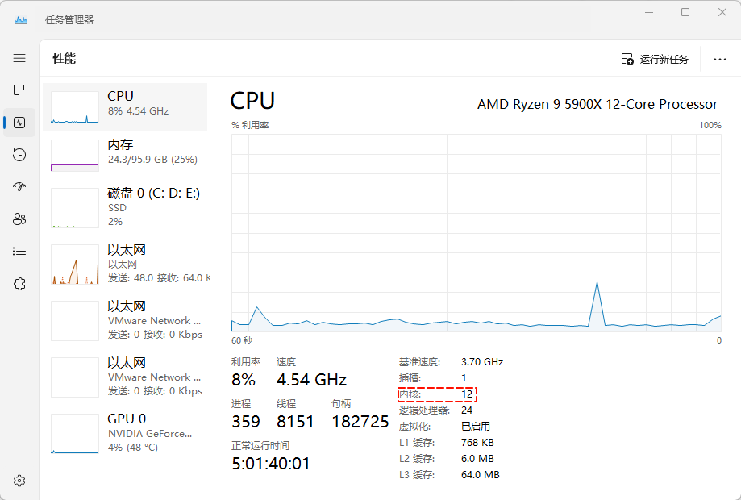

# 第一章：程序到底是怎么在计算机中运行的？

## 1.1 回顾冯·诺依曼体系结构

* `冯·诺依曼`体系结构的理论要点如下：
  - ① **存储程序**：`程序指令`和`数据`都存储在计算机的内存中，这使得程序可以在运行时修改。
  - ② **二进制逻辑**：所有`数据`和`指令`都以`二进制`形式表示。
  - ③ **顺序执行**：指令按照它们在内存中的顺序执行，但可以有条件地改变执行顺序。
  - ④ **五大部件**：计算机由`运算器`、`控制器`、`存储器`、`输入设备`和`输出设备`组成。
  - ⑤ **指令结构**：指令由操作码和地址码组成，操作码指示要执行的操作，地址码指示操作数的位置。
  - ⑥ **中心化控制**：计算机的控制单元（CPU）负责解释和执行指令，控制数据流。

* `冯·诺依曼`体系结构中的五大部件，如下所示：


> [!NOTE]
>
> 上述的组件协同工作，构成了一个完整的计算机系统：
>
> - `运算器`和`控制器`通常被集成在一起，组成中央处理器（CPU），负责数据处理和指令执行。
> - `存储器`（内存）保存数据和程序，是计算机运作的基础。
> - `输入设备`和`输出设备`负责与外界的交互，确保用户能够输入信息并接收计算机的处理结果。

## 1.2 现代计算机和`冯·诺依曼`体系结构的关系

* 现代微型个人计算机中主板的结构，如下所示：


* 其中，`控制器`在冯·诺依曼体系结构中主要负责指令的解释和控制，它对应于 CPU 内部的`控制单元（Control Unit，CU）`，其主要功能有：
  * ① `指令的取指、解码和控制`：将指令发送给CPU的各个单元执行。
  * ② `发出控制信号`：协调各部件（如存储器和I/O设备）之间的数据交换和操作。

> [!NOTE]
>
> `控制器`，即：`控制单元`，是 CPU 的核心管理者，使得指令得以被顺序执行，并管理程序流程。

* 其中，`运算器`在冯·诺依曼体系结构中主要用于执行各种算术运算和逻辑运算，它对应于 CPU 内部的`算术逻辑单元（Arithmetic Logic Unit，ALU）`，其主要功能有：
  * ① `处理算术运算`：加、减、乘、除等算术操作。
  * ② `处理逻辑运算`：与、或、非等逻辑操作。

> [!NOTE]
>
> `运算器`，即：`算术逻辑单元`，使得 CPU 可以直接处理数据运算，是计算机执行计算任务的核心。

* 其中，`存储器`在冯·诺依曼体系结构中主要用于存放程序指令和数据，对应于计算机的`主存储器（RAM）`，也包括 CPU 内部的 `寄存器（Register）`和`缓存（Cache）`，其主要功能有：
  * ① `寄存器`：寄存器是 CPU 内部的高速存储单元，主要用于临时存储数据和指令。
  * ② `缓存`：缓存是 CPU 中的高速缓存存储器，存放的是最近使用的数据或指令，分为 L1、L2、L3 三级缓存。缓存的作用是减少CPU访问内存的时间，因为缓存比内存的访问速度要快得多。
  * ③ `主存储器`：用于长期存储数据和程序指令，CPU 通过`总线接口单元`与它交互。

> [!NOTE]
>
> `存储器`在冯·诺依曼结构中的位置十分重要，因为程序指令和数据都存储在这里，CPU 直接从这里获取需要的指令和数据。

* 其中，`输入设备`提供外界与计算机交互的方式，如：键盘、鼠标等，用户通过这些设备向计算机输入数据或指令。在现代计算机中，输入设备通过 I/O 接口连接到计算机系统，CPU 通过总线控制与它们通信。

> [!NOTE]
>
> * ① 虽然输入设备不直接存在于 CPU 内部，但它们在计算机系统整体架构中属于不可缺少的部件。
> * ② 控制器发出的信号可以协调 CPU 从输入设备接收数据。

* 其中，`输出设备`是冯·诺依曼结构中实现计算结果输出的部分，如：显示器、打印机等。CPU 处理完数据后，最终需要通过输出设备来将结果展示给用户。

> [!NOTE]
>
> 和输入设备一样，输出设备也通过 I/O 接口连接到计算机系统，控制器和总线接口单元负责协调 CPU 与输出设备的交互。

## 1.3 现代 CPU 的结构

* 现代 CPU 在主板上的示意图，如下所示：


> [!NOTE]
>
> 现代 CPU  除了控制单元、算术逻辑单元、寄存器、缓存等，还有浮点运算单元、总线接口单元、分支预测单元、指令流水线以及超标量单元和多核单元：
>
> * ① `浮点运算单元`（Floating Point Unit，FPU）：专门用于处理浮点数运算。浮点运算通常比整数运算复杂且计算量大，因此 FPU 可以加速此类操作，尤其是在科学计算、图形处理等需要大量小数计算的应用中。
> * ② `总线接口单元`（Bus Interface Unit，BIU）：负责与系统总线，如：数据总线和地址总线进行交互，将数据在CPU和主存储器之间传递。它管理从内存加载指令和数据到CPU，以及将计算结果写回到内存。
> * ③ `分支预测单元`（Branch Predictor Unit）：分支预测单元用于预测程序中的分支，如：if-else、循环跳转等，将会如何执行。正确的预测可以避免不必要的指令等待，提高执行效率。
> * ④ `指令流水线`（Instruction Pipeline）：指令流水线允许多个指令同时进行不同阶段的处理（如：取指令、解码、执行等），从而提升 CPU 的并行处理能力，使得 CPU 在同一时刻能高效地处理多条指令。
> * ⑤ `超标量单元`和`多核结构`：每个核都有独立的 ALU 和 CU，可以并行处理不同任务，实现`多线程`和`并行计算`。

## 1.4 程序到底是怎么在计算机中运行的？

### 1.4.1 概述

* 程序在计算机中运行的过程涉及多个复杂的步骤，从代码到实际的机器执行分为几个主要阶段：编写代码、编译或解释代码、加载程序、CPU 执行指令和与硬件交互。
* 程序在计算机中运行的主要流程，如下所示：


### 1.4.2 编写代码

* 程序员用高级编程语言，如：Python、Java、C、C++等，编写程序代码。这些高级语言对人类更友好，但计算机无法直接理解这些代码。

### 1.4.3 编译或解释

* 代码编写完成后，需要经过编译或解释的步骤：
  - `编译`（Compile）：将高级语言代码转换为机器码。机器码是计算机能够直接执行的二进制代码。像 C、C++ 这样的编译型语言需要通过编译器将代码编译成可执行文件。
  - `解释`（Interpret）：解释型语言，如：Python等，不需要编译为机器码，而是由解释器逐行读取和执行代码。在这种情况下，解释器本身负责将代码翻译为机器能够执行的指令。

### 1.4.4 加载程序

* 一旦代码被编译或准备好，操作系统（Windows、Linux、macOS） 会将程序加载到内存中。
* 操作系统中的`加载器`（Loader）负责将程序的机器代码加载到内存中，并为程序分配资源，如：内存空间、文件句柄等。

### 1.4.5 CPU 执行指令

* 程序加载到内存后，CPU便开始执行指令。整个过程如下：
  * `取指令`（Fetch）：CPU 的控制单元从内存中获取下一条指令。
  * `解码指令`（Decode）：控制单元将指令译码成具体的操作。不同指令会涉及不同的操作类型，如：算术运算、逻辑运算、数据移动等。
  * `执行指令`（Execute）：CPU 执行指令，完成指定的操作。操作可能包括计算、存取内存、跳转到其他指令等。
  * `写回`（Writeback）：执行完的结果可能被写回到寄存器或内存中，供后续指令使用。

### 1.4.6 与硬件交互

* 计算机程序的执行不仅仅是 CPU 处理指令，还涉及到不同硬件的协作，如：内存、硬盘、输入输出设备等。
* 通过操作系统的管理，程序可以访问并控制这些硬件，例如：
  - `内存管理`：操作系统分配内存给程序，CPU 在运行时不断从内存中取出指令和数据。
  - `硬盘存储`：程序可能需要从硬盘读取或写入数据。
  - `I/O操作`：程序需要与外部设备交互，如：显示输出、接收键盘输入等。


# 第二章：虚拟地址空间

## 2.1 概述

* 如果你学习 C 语言，那么就可以通过 `&` 运算符来获取变量的内存地址，如下所示：

```c
#include <stdio.h>

// 全局变量
int a = 10;
int b = 20;

int main() {

    // 禁用 stdout 缓冲区
    setbuf(stdout, nullptr);

    printf("a = %p\n", &a); // a = 0x55fda7351010
    printf("b = %p\n", &b); // b = 0x55fda7351014

    return 0;
}

```

* 我们也知道，现代操作系统是`多用户`、`多任务`、`图形化`、`网络化`的操作系统。其中，所谓的`多任务`就是可以支持多个应用程序（进程），如下所示：


> [!NOTE]
>
> * ① 正如上面的程序一样，程序在链接的时候，内存地址就已经确定了，无法改变。
> * ② 如果此时，物理内存中的内存地址已经被该程序占用了，那么其它程序岂不是运行不了？
> * ③ 如果此时，物理内存中的内存地址已经被其它程序占用了，那么该程序岂不是运行不了？

* 其实，这些地址都是假的，并不是真实的物理地址，而是虚拟地址（虚地址）。虚拟地址（虚地址）需要通过 CPU 内部的 MMU（Memory Management Unit，内存管理单元）来将这些虚拟地址（虚地址）转换为物理地址（实地址），如下所示：


## 2.2 虚拟地址空间模型

* 为了更好的管理程序，操作系统将虚拟地址空间分为了不同的内存区域，这些内存区域存放的数据、用途、特点等皆有不同，下面是 Linux 下 32 位环境的经典内存模型，如下所示：


* 每个内存区域的特点，如下所示：

| 内存分区                  | 说明                                                         |
| :------------------------ | :----------------------------------------------------------- |
| 程序代码区（code）        | 存储程序的执行代码，通常为只读区，包含程序的指令。 程序启动时，这部分内存被加载到内存中，并不会在程序执行期间改变。 |
| 常量区（constant）        | 存放程序中定义的常量值，通常也是只读的，这些常量在程序运行期间不可修改。 |
| 全局数据区（global data） | 存储程序中定义的全局变量和静态变量。 这些变量在程序的整个生命周期内存在，且可以被修改。 |
| 堆区（heap）              | 用于动态分配内存，例如：通过 `malloc` 或 `new` 分配的内存块。 堆区的内存由程序员手动管理，负责分配和释放。 如果程序员不释放，程序运行结束时由操作系统回收。 |
| 动态链接库                | 动态链接库（如： `.dll` 或 `.so` 文件）被加载到内存中特定的区域，供程序运行时使用。 |
| 栈区（stack）             | 用于存储函数调用的局部变量、函数参数和返回地址。 栈是自动管理的，随着函数的调用和返回，栈上的内存会自动分配和释放。 |

> [!NOTE]
>
> - ① 程序代码区、常量区、全局数据区在程序加载到内存后就分配好了，并且在程序运行期间一直存在，不能销毁也不能增加（大小已被固定），只能等到程序运行结束后由操作系统收回，所以全局变量、字符串常量等在程序的任何地方都能访问，因为它们的内存一直都在。
> - ② 函数被调用时，会将参数、局部变量、返回地址等与函数相关的信息压入栈中，函数执行结束后，这些信息都将被销毁。所以局部变量、参数只在当前函数中有效，不能传递到函数外部，因为它们的内存不在了。
> - ③ 常量区、全局数据区、栈上的内存由系统自动分配和释放，不能由程序员控制。程序员唯一能控制的内存区域就是堆（Heap）：它是一块巨大的内存空间，常常占据整个虚拟空间的绝大部分，在这片空间中，程序可以申请一块内存，并自由地使用（放入任何数据）。堆内存在程序主动释放之前会一直存在，不随函数的结束而失效。在函数内部产生的数据只要放到堆中，就可以在函数外部使用。

* 在 64 位 Linux 环境下，虚拟地址空间大小为 256TB，Linux 将高 128TB 的空间分配给内核使用，而将低 128TB 的空间分配给用户程序使用，如下所示：


> [!NOTE]
>
> * ① `程序代码区`，也可以称为`代码段`；而`全局数据区`和`常量区`，也可以称为`数据段`。
> * ② `全局数据区`分为`初始化数据段`（存储已初始化的全局变量和静态变量）和`未初始化数据段`（存储未初始化的全局变量和静态变量）；`常量区`也称为`只读数据段`，通常是只读的，防止数据被修改。
> * ③ 冯·诺依曼体系结构中的`程序`，也被称为`存储式程序`，需要通过加载器（Loader），将程序从硬盘加载到内存中运行。
> * ④ `存储式程序`中的`程序`分为`指令`和`数据`；其中，`代码段`中保存的是`指令`，`数据段`中保存的是`数据`。


# 第三章：虚拟内存地址

## 3.1 内存和内存地址

### 3.1.1 内存

* `内存`是一种`计算机硬件`，是`软件`在`运行过程`中，用来`临时存储数据`的。在生活中，最为常见的`内存`就是`随机存取存储器（RAM，内存条`），其特点如下所示：
  * ① 生活中最常见的内存类型，用于存储当前运行的程序和数据。
  * ② 内存是易失性存储器，这意味着断电后数据会丢失。
  * ③ 它具有高速读写特性，适用于需要快速访问的操作。

* 内存条的外观，如下所示：


* 像我们平常使用`记事本`软件一样，当我们输入一些文字的时候，其实是将数据`临时`保存在内存中的，如下所示：

> [!NOTE]
>
> * ① 目前，很多软件都很智能，如果用户没有将数据到保存文件中，将显示红色，以警告用户还没有保存数据，提醒用户需要尽快保存数据！！！
> * ② 但是，也有很多软件提供了自动保存数据的功能，其原理就是定时（1s、3s、5s）将内存中的数据刷新到文件中，以防止数据丢失！！！
> * ③ 将数据从内存存储到文件中，专业的说法是落盘（落在磁盘上）。


* 此时，如果我们在没有保存的过程下，将`记事本`软件关闭，那么刚才输入的文字将丢失；下次，再打开同样的文件（将数据从磁盘加载进内存，再交给 CPU），之前输入的文字将不复存在，如下所示：

> [!NOTE]
>
> * ① 目前，很多软件都很智能，如果你没有保存，将提醒你是否保存或丢失刚才输入的文字。
> * ② 但是，也有很多软件提供了自动保存数据的功能，其原理就是定时（1s、3s、5s）将内存中的数据刷新到文件中，以防止数据丢失！！！
> * ③ 将数据从内存存储到文件中，专业的说法是落盘（落在磁盘上）。


> [!IMPORTANT]
>
> 内存就是软件在运行过程中，用来临时存储数据的，最为重要的两个步骤就是：
>
> * ① 将数据`保存`到内存中。
> * ② 从内存中的`对应位置`将数据`取出来`。

### 3.1.2 内存地址

* 在这个计算机的内存条，动不动就 `32GB`、`64GB` 、`128GB` 或更高的年代，如下所示：



* 如果有一个 int （4 个字节）类型的数据 `2` ，如何将这个数据保存到内存中？（对应上述的步骤 ①）


* 就算数据 `2` 已经保存到内存中，那么内存中那么多的数据，我们又该如何取出呢？（对应上述的步骤 ②）


> [!IMPORTANT]
>
> 答案就是`内存地址`。

* 操作系统为了更快的去管理内存中的数据，会将`内存条`按照`字节`划分为一个个的`单元格`，如下所示：


> [!NOTE]
>
> 计算机中存储单位的换算，如下所示：
>
> - 1 B = 8 bit。
> - 1 KB = 1024 B。
> - 1 MB = 1024 KB。
> - 1 GB = 1024 MB。
> - 1 TB = 1024 GB 。
> - ……

* 为了方便管理，每个独立的小单元格，都有自己唯一的编号（内存地址），如下所示：


* 之所以，加了`内存地址`，就能`加快`数据的存取速度，可以类比生活中的`字典`：

  * 如果没有使用`拼音查找法`或`部首查找法`，我们需要一页一页，一行一行的，在整个字典中去搜索我们想要了解的汉字，效率非常低（如果要搜索的汉字在最后一页，可能需要将整个字典从头到尾翻一遍，这辈子真有可能翻得完？）。

  

  * 如果使用`拼音查找法`或`部首查找法`，我们可以很快的定位到所要了解汉字所在的页数，加快了搜索的效率。

  

  

* 同样的道理，如果`没有`内存地址，我们只能一个个的去寻找想要的数据，效率非常低下，如下所示：


* 如果`使用`内存地址，我们就可以直接定位到指定的数据，效率非常高，如下所示：



> [!IMPORTANT]
>
> 内存地址就是虚拟内存空间中某个内存单元（某一个字节区域）的唯一标识。
>
> * ① 内存地址是计算机中用于标识内存中某个特定位置的数值。
> * ② 每个内存单元都有一个唯一的地址，这些地址可以用于访问和操作存储在内存中的数据。

### 3.1.3 变量地址

* 和内存地址相对应的还有一个非常重要的概念就是：变量地址。

> [!NOTE]
>
> 变量地址就是变量所占虚拟内存空间中的第一个字节的内存地址，即：首地址。

* 以 `int` 类型的变量 `num` 为例，如下所示：

```c
#include <stdio.h>

int main() {

    // 禁用 stdout 缓冲区
    setbuf(stdout, nullptr);

    int num = 10; // [!code highlight]

    printf("num = %p\n", &num);

    return 0;
}
```

* 在 32 或 64 位操作系统中， `int` 类型的变量 `num` 的地址指的是：在内存中占用 4 个字节内存单元的首地址，如下所示：



## 3.2 虚拟内存地址

* 计算机的总线层次结构是这样的，如下所示：


* 对于 32 位操作系统中，CPU 的寄存器宽度是 32 位，因为它一次性处理的数据量是 32 位（4字节），那么内存地址范围就是`0000 0000 0000 0000 0000 0000 0000 0000` ~ `1111 1111 1111 1111 1111 1111 1111 1111` （2 ^ 32 次方）。

> [!NOTE]
>
> * ① 在实际开发中，如果使用二进制实现太长了，我们通常都是使用十六进制来表示的。
> * ② 所以，32 位操作系统的虚拟内存地址范围是：`0x000000000`~ `0xFFFFFFFFF`。

* 对于 64 位操作系统中，CPU 的寄存器宽度是 64 位，因为它一次性处理的数据量是 64 位（8字节），那么内存地址范围就是`0000 0000 0000 0000 0000 0000 0000 0000 0000 0000 0000 0000 0000 0000 0000 0000` ~ `1111 1111 1111 1111 1111 1111 1111 1111 1111 1111 1111 1111 1111 1111 1111 1111` （2 ^ 64 次方）。

> [!NOTE]
>
> - ① 在 64 位的操作系统中，一共有 18,446,744,073,709,551,616 个内存地址，其最大支持的内存大小是 18,446,744,073,709,551,616 字节，即 17,179 TB 。
> - ② 虽然，从理论上 64 位的操作系统支持的内存最大容量是 17,179 TB；但是，实际操作系统会有所限制，如：win11 的 64 位支持的最大内存是 128 GB ~ 6 TB，Linux 64 位支持的最大内存通常是 256 TB。
> - ③ 所以，64 位操作系统的虚拟内存地址范围是：`0x000000000000`~ `0x0000FFFFFFFFFFFF `。

## 3.3 高地址和低地址

* Linux 32 位的虚拟地址空间，如下所示：


* 所谓的`低地址`：就是位于内存取值范围的较低端，即接近 0 的地址。
* 所谓的`高地址`：就是位于内存取值范围的较高端，即接近最大的地址。

## 3.4 小端存储法

* 在 32 位操作系统中，对于整型变量 `num` ，如下所示：

```c
#include <stdio.h>

int main() {

    // 禁用 stdout 缓冲区
    setbuf(stdout, nullptr);
    
    int num = 10; // [!code highlight]

    printf("num = %p\n", &num); 

    return 0;
}

```

* 我们知道，有符号数在计算机底层是采取的二进制补码的形式存储的，如下所示：


* 如果要存储到虚拟内存空间中，是按照顺序从低到高进行存储？


* 在 `x86_64` 等架构的 CPU 中，采取的是`小端存储法`，即：数据的`最低有效字节`存储在内存的`低地址处`，`高位字节`存储在高地址处，如下所示：


* 那么，如果采用小端存储在内存中就是这样的，如下所示：


* 需要注意的是，之前我们在画虚拟内存地址的时候，都是由低向高，方向是`↑`；但是，在很多编译器中，虽然虚拟内存地址还是由低向高，方向却是反的，即：`↓`，因为这样更容易调试，如下所示：


* 在 CLion 中，也可以证明，如下所示：


## 3.5 大端存储法

* 所谓大端存储法，指的是在存储数据时，选择将此数据的`最低有效位字节存储`在`高内存地址`上。


> [!NOTE]
>
> 大端存储法则比较符合直觉，直接将数据按照高有效位到低有效位，存储在低地址到高地址当中。

* 大端存储法最常见的场景就是：网络传输数据时，使用大端存储法来进行数据传输。


# 第四章：多线程

## 4.1 概述

* 之前提高，在现代 CPU 的结构中，现代 CPU 中使用`超标量单元`和`多核结构`：每个核都有独立的 ALU 和 CU，可以并行处理不同任务，实现`多线程`和`并行计算`。
* 那么，到底什么是多线程？

## 4.2 多核 CPU 

* 在早期，CPU 只有一个核心，即：在任意时刻，单核 CPU 只能处理一个任务，如下所示：


* 但是，随着技术的发展，CPU 开始朝着多核的方向发展，即：给 CPU 安装多个核心，每个核心都能独立的执行计算机指令；换言之，对于多核 CPU 而言，同一时刻可以处理多个任务，大幅度的提升程序的执行效率，如下所示：


* 就目前而言，我们生活中常见的电子设备几乎都是多核的，如：台式机、笔记本电脑、手机、平板等。



* 之前，我们编写的程序，都是单线程的程序，即：在任意时刻只能执行一条指令，整个运行过程中也就利用了 CPU 的一个核心，如下所示：

```c
#include <stdio.h>

int main(){
    printf("Hello World");
    return 0;
}
```

* 如果要想发挥 CPU 多核的威力，我们还需要学习多线程编程技术，即：在任意时刻可以执行多个任务，充分利用 CPU 多核的优势，让程序的执行效率得到质的提升。

## 4.3 什么是线程？

### 4.3.1 概述

* 对于线程，很多教科书都是这么说的，如下所示：

> [!NOTE]
>
> * ① 线程是操作系统能够进行运算调度的最小单位，它被包含在进程中，是进程的实际运作单位。
> * ② 线程是进程中的⼀个执⾏单元，负责当前进程中程序的执⾏，⼀个进程中⾄少有⼀个线程。
> * ③ 在计算机专用术语中，线程是指机器中连续的、顺序的属性集合。一个线程包含执行一系列机器指令所必须的机器状态，包括：当前指令位置、地址和数据寄存器等。

* 上面的说法完全正确，非常严谨；但是，总感觉“`好像说了什么，又好像没说什么？`”

> [!IMPORTANT]
>
> 其实，线程和进程的关系非常密切，要想搞清楚线程是什么，就必须搞清楚进程是什么？

### 4.3.2 进程（process）

* 对于常见的操作系统，如：Windows、Linux 和 MacOS 而言，它们都属于`多用户`、`多任务`、`网络化`的操作系统。

> [!NOTE]
>
> * ① Linux 并不完全属于`图形化`的操作系统，Linux 完全可以在没有图形化界面的情况下执行任务。
> * ② Windows 和 MacOS 完全属于`图形化`的操作系统。

* 在实际生活中，我们经常接触到的操作系统可能就是 Windows 了（`MacOS 系列实在是太贵了`），它可以同时支持运行 QQ、微信、Chrome 浏览器等多个应用程序，所以 Windows 当然是`多任务`的操作系统。
* 在多任务的操作系统中，对于同时执行的多个程序，操作系统负责给它们分配所需要的全部资源（，如：CPU、内存、I/O 设备等），还负责在恰当的时机（如：程序执行结束后）回收这些资源，以便后期其它的程序使用。
* 为了让操作系统高效的管理（分配和回收）这些计算机资源，人们就提出了`进程`的概念。

> [!NOTE]
>
> 通过`创建`进程和`销毁`进程，操作系统就实现了对计算机资源的高效管理。
>
> * ① 当一个程序执行的时候，操作系统负责分配所需要的全部资源，包括：程序代码、数据、CPU、内存以及 I/O 设备等，这些资源就会被组织成一个进程。换言之，在程序执行的时候，操作系统会创建进程并给它分配资源。
>
>   
>
> * ② 当程序执行完毕后，操作系统就会销毁进程并回收资源。

* 虽然`进程`通常代表了一个正在执行的程序，但进程和程序之间并非总是严格的一一对应关系。

> [!NOTE]
>
> 进程可以理解为“正在执行的程序的实例”，但一个程序不一定只对应一个进程。
>
> * ① `程序`和`进程`的区别：
>   * `程序`是存储在磁盘上的静态代码和数据，是一组指令的集合，本身不占用 CPU 时间、内存等资源。
>   * `进程`是程序运行后的动态表现，包含程序的指令、数据、以及用于运行程序的资源，如：CPU 时间、内存、文件句柄等。
> * ② `进程`和`程序`的关系：
>   * 当一个`程序`被执行时，系统会为其创建一个`进程`，分配运行所需的资源，即：一个运行中的程序通常对应一个进程。
>   * 一个`程序`可以启动多个`进程`，如：用户可以多次启动同一个应用程序（打开多个文本编辑器窗口），每次启动都会创建一个新的进程。
> * ③ 进程并非总是单一执行：
>   * 有些复杂应用（浏览器）会生成多个进程来分工，如：一个主进程负责管理，多个子进程负责不同的功能（渲染页面、处理插件等）。
>   * 在这种情况下，一个应用程序可能对应多个进程。

* 对于系统中存在的多个进程，每个进程都拥有自己的内存空间和系统资源，它们之间相对独立，执行过程中不会互相干扰。

> [!NOTE]
>
> * ① 进程包含程序执行所需要的全部计算机资源，包括程序代码、数据、CPU、内存、I/O 设备等。
> * ② 操作系统以进程为单位管理（分配和回收）计算机资源，也就是很多教材中讲的“进程是操作系统进行资源分配和调度的基本单位”。

### 4.3.3 线程（thread）

* 我们知道，每个正在执行的应用程序都是一个进程，如下所示：


* 一个完整的程序可能有多个子任务组成，有些任务是可以独立执行的（和其它的任务是同时执行的），每个独立执行的任务就是一个线程，如下所示：


* 也就是说，线程是进程的一部分，进程和线程的关系，如下所示：


> [!NOTE]
>
> * ① `一个进程可以包含多个线程`，这些`线程`可以`共享`进程的`内存空间`和一些`系统资源`，包括：`程序代码`、`数据`（`全局变量`、`静态变量`、`堆内存`）、打开的文件资源、网络连接等。当然，各个`线程`也有自己`私有`的资源，如：`程序计数器`、`寄存器`和`栈`等。
> * ② `一个进程至少要包含 1 个线程`：进程只是操作系统为了方便管理计算机资源才创建的，真正负责执行程序的是线程，而不是进程。

* 当一个进程`只有`一个线程的时候，所有的程序代码全部由该线程负责执行，这样的程序叫做`单线程`程序。

* 当进程中`包含`多个线程时，每个线程分别负责执行一个任务，这样的程序叫做`多线程`程序。

> [!CAUTION]
>
> `单线程程序`和`多线程程序`各有优缺点，如下所示：
>
> * ① 单线程程序编写简单、易于调试，但是只能顺序执行程序，适用于简单的应用场景。
> * ② 多线程程序可以同时执行多个任务，执行效率高，但编写和调试过程比较复杂，容易出现数据竞争、死锁等问题，适用于复杂的应用场景。

### 4.3.4 现实生活中的进程和线程的关系

* 如果将`进程`看做是一个`工厂`的话，那么`线程`就是工厂中的一条条`生产线`，如下所示：


### 4.3.5 总结

* 进程可以是使操作系统高效地管理计算机资源：当程序执行时，操作系统会创建一个进程，进程包含程序执行所需要的全部资源（CPU、内存、I/O 设备等）；当程序执行结束后，对应的进程会被操作系统销毁，占用的资源也会被操作系统回收。

> [!NOTE]
>
> * ① 线程是进程的一部分，一个进程可以包含多个线程，但至少要包含一个线程。
> * ② 真正负责执行程序的，是线程，而不是进程。

*  目前，很多应用程序（软件）都是多线程程序，如：QQ 支持同时和多个好友聊天、迅雷可以同时下载多个资源、大部分杀毒软件可以同时开启杀毒、清理垃圾、电脑加速等功能。

> [!NOTE]
>
> 在实际开发中，只会简单的`单线程编程`已经远远不足以满足实际项目需求，还需要学会`多线程编程`！！！

