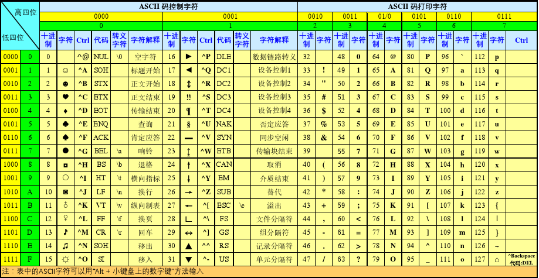
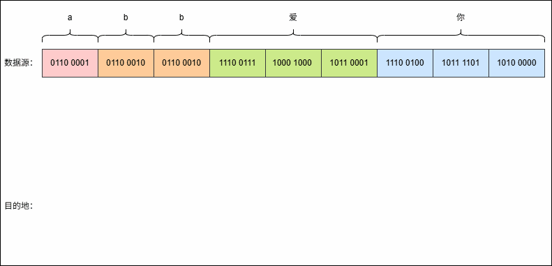
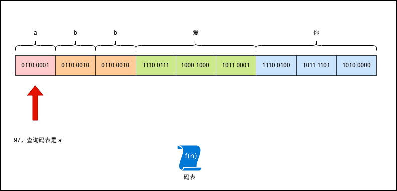
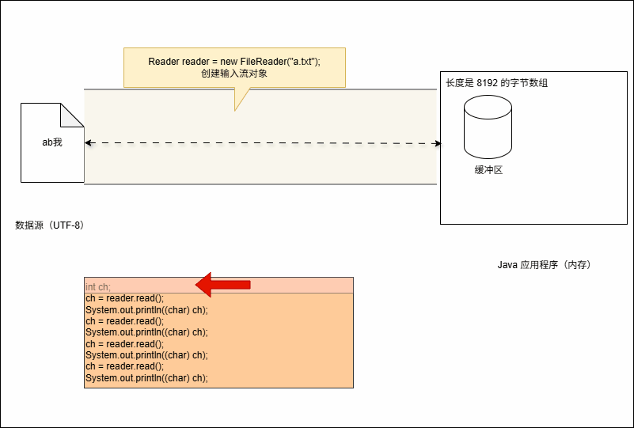
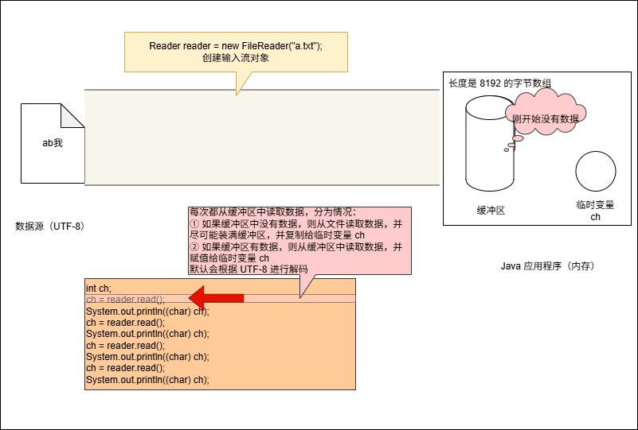
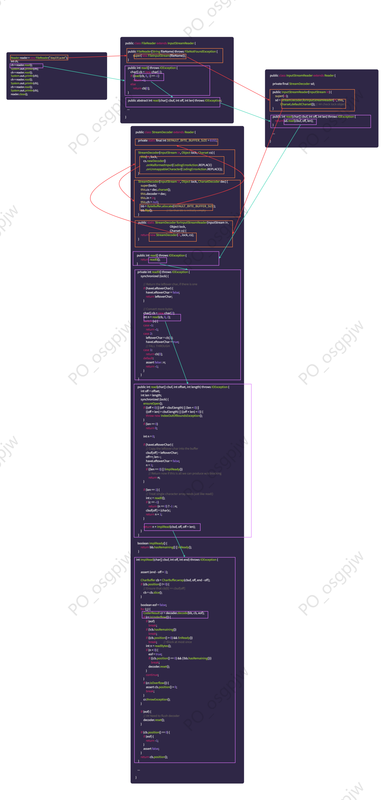
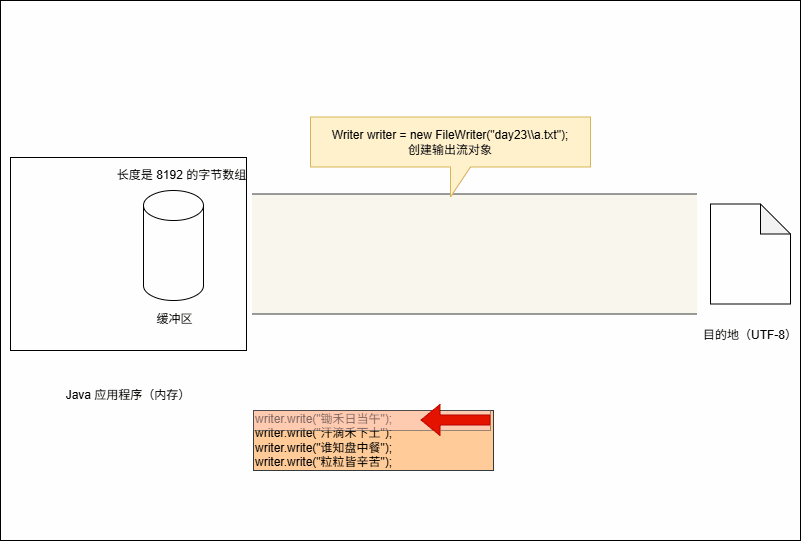
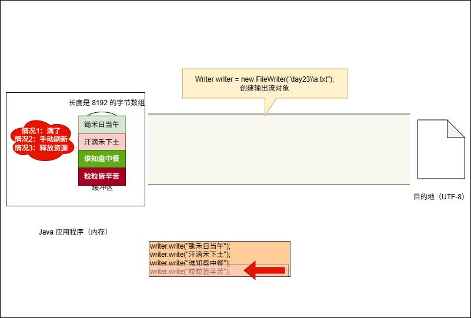
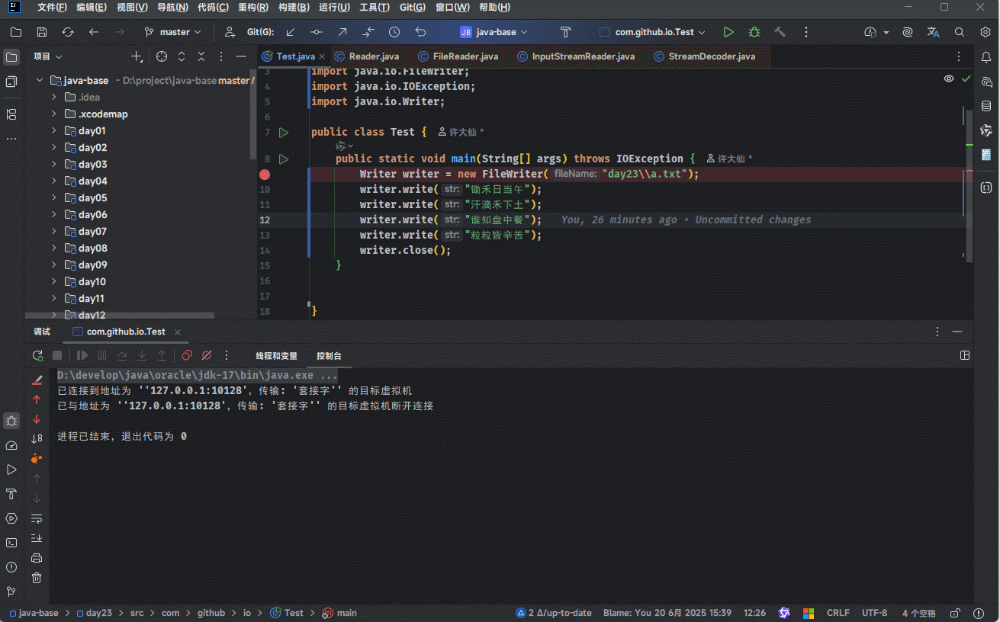

# 第一章：IO 流（⭐）

## 1.1 概述

### 1.1.1 简介

- I/O 是 Input 和 Output 的缩写，IO 技术是非常实用的技术，用于 `处理设备之间的数据传输` ，如：读写文件、网络通讯等。

> [!NOTE]
>
> IO 流是存储数据和读取数据的解决方案！！！

- 因为 IO 流和 File 息息相关；所以，我们有必要先回顾 File 。

### 1.1.2 File 和 IO 流

* File 是用来表示系统中`文件`或者文件夹的路径。我们可以利用 File 完成以下功能：
  * ① 获取文件信息（大小、文件名、最后修改时间）。
  * ② 判断文件的类型（文件还是文件夹）。
  * ③ 创建文件或文件夹。
  * ④ 删除文件或文件夹。
  * ⑤ ....

> [!CAUTION]
>
> * File 类只能对文件文本进行操作，并不能读写文件里面存储的数据！！！
> * 如果要进行读写数据，必须要使用 IO 流技术。

* IO 流是用来读写文件中的数据（可以读写文件，或网络中的数据...）。
* 其中，IO 流可以将程序中的数据保存（写出）到本地文件中，我们称之为：`写`（Output，写出数据）。


* 其中，IO 流可以将本地文件中的数据读取（加载）到程序中，我们称之为：`读`（Input，读取数据）。


* 在 IO 流中，是以`程序`作为参照物来看读写的方向的。

> [!NOTE]
>
> * ① 是程序在读取文件中的数据，也是程序在向文件中写出数据。
> * ② 因为程序是运行在内存中，所以也可以将`内存`作为参照物来看读写的方向的。


### 1.1.3 IO 流分类

* 在 Java 中，IO 流有很多很多种（BIO，Blocking I/O，阻塞式 I/O），如下所示：

> [!NOTE]
>
> 在 Java 中，IO 流的模型分为以下几种：
>
> | 名称 | 全称             | 中文含义   | 模型类型   |
> | ---- | ---------------- | ---------- | ---------- |
> | BIO  | Blocking I/O     | 阻塞式 I/O | 同步阻塞   |
> | NIO  | Non-blocking I/O | 非阻塞 I/O | 同步非阻塞 |
> | AIO  | Asynchronous I/O | 异步 I/O   | 异步非阻塞 |
>
> 目前，我们学习的是 BIO，即：阻塞式 I/O，至于什么是阻塞式 I/O，在多线程和网络编程那边讲解！！！

```txt
├─📄 Bits.java
├─📄 BufferedInputStream.java
├─📄 BufferedOutputStream.java
├─📄 BufferedReader.java
├─📄 BufferedWriter.java
├─📄 ByteArrayInputStream.java
├─📄 ByteArrayOutputStream.java
├─📄 CharArrayReader.java
├─📄 CharArrayWriter.java
├─📄 CharConversionException.java
...
├─📄 DataOutput.java
├─📄 DataOutputStream.java
├─📄 DefaultFileSystem.java
├─📄 DeleteOnExitHook.java
├─📄 EOFException.java
├─📄 ExpiringCache.java
├─📄 Externalizable.java
...
├─📄 FileCleanable.java
├─📄 FileDescriptor.java
├─📄 FileFilter.java
├─📄 FileInputStream.java
├─📄 FilenameFilter.java
├─📄 FileNotFoundException.java
├─📄 FileOutputStream.java
...
```

> [!NOTE]
>
> 为了更好的学习 IO 流，我们有必要先对它们进行分类，即：先有一个整体的认识，再一个个的学习。

* 根据`流的方向`，我们可以将 IO 流，做如下的分类：


* 根据`操作文件的类型`，我们可以将 IO 流，做如下的分类：

> [!NOTE]
>
> * ① 字节流可以操作所有类型的文件，包括：图片文件、文本文件、音频文件以及视频文件等等。
> * ② 字符流可以操作文本类型的文件。


* 对于纯文本文件，最简单的判断方式：使用 Windows 自带的记事本软件。

> [!NOTE]
>
> * ① 如果某个文件，Windows 自带的记事本软件能打开，显示出来不乱码，就是纯文本文件。
> * ② 如果某个文件，Windows 自带的记事本软件能打开；但是，显示出来乱码，就不是纯文本文件。


## 1.2 IO 流体系

* IO 流按照`操作文件的类型`进行分类，可以分为`字节流`和`字符流`：


* 以`字节流`为例，按照`流的方向`进行分类，可以分为`字节输入流`和`字节输出流`：


* 以`字符流`为例，按照`流的方向`进行分类，可以分为`字符输入流`和`字符输出流`：


* 但是，InputStream、OutputStream、Reader 以及 Writer 都是抽象类，是不能实例化的：

> [!NOTE]
>
> ::: code-group
>
> ```java [InputStream.java]
> public abstract class InputStream implements Closeable {}
> ```
>
> ```java [OutputStream.java]
> public abstract class OutputStream implements Closeable, Flushable {}
> ```
>
> ```java [Reader.java]
> public abstract class Reader implements Readable, Closeable {}
> ```
>
> ```java [Writer.java]
> public abstract class Writer implements Appendable, Closeable, Flushable {}
> ```
>
> :::


> [!NOTE]
>
> 为了创建流的实例（对象），我们还需要它们的子类！！！

* 以字节输入流（InputStream）为例，其子类是 FileInputStream，如下所示：


* 以字节输出流（OutputStream）为例，其子类是 FileOutputStream，如下所示：


* 同理，字符输入流（Reader）和字符输出流（Writer）的继承体系就是这样，如下所示：


# 第二章：字符集

## 2.1 概述

* 之前，我们在学习字节流的时候，提过读取文件的时候，文件中的内容尽量是英文：

::: code-group

```java [Test.java]
package com.github.file;

import java.io.FileInputStream;
import java.io.IOException;
import java.io.InputStream;

public class Test {
    public static void main(String[] args) throws IOException {
        // 创建输入流对象
        InputStream is = new FileInputStream("day23\\a.txt");
        // 读取数据
        // 一次读取一个字节，读取的数据是在 ASCII 码表上字符对应的数字
        // 读取到文件末尾，返回 -1
        int b;
        while ((b = is.read()) != -1) {
            System.out.println(Character.toChars(b));
        }
        // 释放资源
        is.close();

    }
}
```

```md:img [cmd 控制台]

```

:::

* 但是，劳资不信这个邪，我就要在读取文件的时候，文件中的内容是中文：

::: code-group

```java [Test.java]
package com.github.file;

import java.io.FileInputStream;
import java.io.IOException;
import java.io.InputStream;

public class Test {
    public static void main(String[] args) throws IOException {
        // 创建输入流对象
        InputStream is = new FileInputStream("day23\\a.txt");
        // 读取数据
        // 一次读取一个字节，读取的数据是在 ASCII 码表上字符对应的数字
        // 读取到文件末尾，返回 -1
        int b;
        while ((b = is.read()) != -1) {
            System.out.println(Character.toChars(b));
        }
        // 释放资源
        is.close();

    }
}
```

```md:img [cmd 控制台]

```

:::

> [!IMPORTANT]
>
> 我们会发现结果是乱码，要解释这个原因，就要将要学习`字符集`和`编码方式（编码规则）`有关了。

## 2.2 计算机的存储规则

### 2.2.1 概述

* 要学习`字符集`和`编码方式（编码规则）`，我们有必要回顾之前学习过的`计算机的存储规则`。

### 2.2.2 计算机的存储规则

* 在计算机中，任意的数据都是以二进制的形式进行存储的，包括：数字、字符、图片、视频等。


* 其实，所谓的二进制就是`0`或`1`，中文称为“比特”，英文称为“bit ”。

> [!NOTE]
>
> * ① 1 bit 只能存储 0 或 1 ，可以存储 2^1 个数字，即：可以表示 2 个数字。
> * ② 计算机中最小的存储单元是 bit 。


* 但是，一个`bit`能存储的数据太少了，通常我们会将`8`个`bit`分为一组，中文称为“字节”，英文称为“Byte”。

> [!NOTE]
>
> * ① 1 Byte 是 8 bit，可以存储 2^8 个数字，即：可以表示 256 个数字。
> * ② 计算机中最基本的存储单元是 Byte 。


> [!IMPORTANT]
>
> * ① 计算机存储英文的时候，1 个字节就可以了，因为英文字母一共 26 个，就算大小写也只有 52 个。
> * ② 计算机到底是如何存储英文的，就和将要学习的`字符集`和`编码方式（编码规则）`有关了。

## 2.3 字符集和编码方式（编码规则）

### 2.3.1 概述

* 字符（Character）是各种文字和符号的总称，如：各个国家的文字、标点符号、数字符号等。

> [!NOTE]
>
> 在 Java 中，我们使用单引号`''`来将`字符`括起来，并使用`char` 来表示`字符`的`数据类型`：
>
> ```java
> char c = '1';
> char c2 = 'A';
> char c3 = '我';
> char c4 = '&';
> ```

* 字符集（Character Set）：字符集是字符的集合，规则了有哪些“字符”可以使用。

> [!NOTE]
>
> 字符集可以理解为：有哪些字符可以用！！！
>
> * ① ASCII 字符集包含了 A-Z、a-z、0-9 以及一些标点符号。
> * ② Unicode 字符集包含了世界上绝大多数的文字和符号，如：中文、日文、阿拉伯文、emoji 等。
> * ③ 常见的字符集：`ASCII`、`GBK` 以及 `Unicode` 。

* 编码方式（Character Encoding，计算机的存储规则）：就是如何将字符转换为二进制数字的规则，以便计算机可以进行存储和传输。

> [!NOTE]
>
> 编码方式可以理解为：字符是如何转变为 0 或 1 。
>
> * ① 每个字符分配一个或多个字节的二进制代码，如：ASCII 字符集，使用 1 个字节存储英文字符；而 GBK 字符集，使用 2 个字节存储汉字字符。
> * ② 同一个字符集可以有多种编码方式，如：Unicode 字符集中的编码方式有 UTF-16、UTF-32 以及 UTF-8 。

### 2.3.2 ASCII 字符集（ASCII 编码规则）

#### 2.3.2.1 ASCII 字符集

* ASCII 字符集是基于`拉丁字母`的一套电脑字符集。

> [!NOTE]
>
> ASCII 是 American Standard Code for Information Interchange（美国信息互换标准代码）的缩写。


* 在 ASCII 字符集中记录了 128 个数据，包含了 A-Z、a-z、0-9 以及一些标点符号。

> [!NOTE]
>
> * ① ASCII 字符集对于大多数基于`拉丁字母`体系的国家来说够用了，如：美国、英国等。
> * ② 字符集可以理解为：有哪些字符可以用，如：`a`可以使用，而`汉`就不可以。

#### 2.3.2.2 ASCII 编码规则

* 在 ASCII 字符集中记录了 128 个数据，包含了 A-Z、a-z、0-9 以及一些标点符号。

> [!NOTE]
>
> ASCII 字符集中字符的序号是 0 - 127 。


* 计算机在存储 ASCII 字符集的字符的时候，首先需要去 ASCII 字符集中查询字符对应的数字：


* 对于英文字符`a`，其在 ASCII 字符集中的数字编号是`97`，换算为二进制是`110 0001`，难道就这样直接存储到计算机中？


* 当然不对，因为计算机中最基本的存储单元是字节（Byte）。

> [!NOTE]
>
> 一个字节是 8 bit，而 97 的二进制只有 7 bit ，不足一个字节（Byte），是不能直接存储的！！！


* 计算机需要进行编码（将字符集中查询到的数据（十进制数字），按照一定的规则进行计算），变为计算机中实际能存储的二进制数据。

> [!NOTE]
>
> ASCII 的编码方式（编码规则，计算机的存储规则）：直接在前面补 0 ，形成 8 bit。


* 如果要进行读取操作，只需要将计算机中存储的二进制数据进行解码（将实际存储在计算机中的二进制数据，按照一定的规则进行计算），还原为字符集中对应的数据（十进制数字）：

> [!NOTE]
>
> ASCII 的解码方式（解码规则，计算机的解码规则）：直接转为十进制。


* 再根据获取到的数据（十进制数字）去 ASCII 字符集中查询对应的字符，即：英文字符`a`：


* 但是，我们经常会在网站上会看到这样的 ASCII 表，其实只是为了方便我们查看而已！！！



### 2.3.3 其他字符集

* `ASCII`字符集中是没有汉字的，为了在计算机中表示汉字，必须设计一个字符集，让每个汉字和一个唯一的数字产生对应关系。
* `GB2312`字符集：1981 年 5 月 1 日实施的简体中文汉字编码国家标准。GB2312 对汉字采用双字节编码，收录 7445 个图形字符，其中包括 6763 个汉字。自 2017 年 3 月 23 日起，该标准转化为推荐性标准：GB/T2312-1980，不再强制执行。

* `BIG5`字符集：台湾地区繁体中文标准字符集，采用双字节编码，原始版本共收录 13053 个中文字，1984 年实施。后续版本增加 F9D6-F9DC 七个汉字，汉字总数 13060 个。
* `GBK`字符集：1995 年 12 月发布的汉字编码国家标准，是对 GB2312 编码的扩充，对汉字采用双字节编码。GBK 字符集共收录 21003 个汉字，包含国家标准 GB13000-1 中的全部中日韩汉字，和 BIG5 编码中的所有汉字。
* `GB18030`字符集：2000 年 3 月 17 日发布的汉字编码国家标准，是对 GBK 编码的扩充，覆盖中文、日文、朝鲜语和中国少数民族文字，其中收录 27484 个汉字。GB18030 字符集采用单字节、双字节和四字节三种方式对字符编码。兼容 GBK 和 GB2312 字符集。2005 年 11 月 8 日，发布了修订版本：GB18030-2005，共收录汉字七万余个。2022 年 7 月 19 日，发布了第二次修订版本：GB18030-2022，收录汉字总数八万余个。

* `Unicode`字符集：国际标准字符集，它将世界各种语言的每个字符定义一个唯一的编码，以满足跨语言、跨平台的文本信息转换。Unicode 采用四个字节为每个字符编码。

> [!NOTE]
>
> 在实际开发中，对我们最为重要的就是`GBK`字符集和`Unicode`字符集：
>
> * ① `GBK`字符集是 Windows 简体中文操作系统默认的字符集。
> * ② `Unicode`字符集和我们之后的工作息息相关。

### 2.3.4 GBK 字符集（GBK 编码规则）

#### 2.3.4.1 存储英文

* GBK 字符集是兼容 ASCII 字符集，即：GBK 字符集也是使用 1 个字节来存储英文的。


#### 2.3.4.2 存储中文

* 假设要存储的中文是`汉`，在 GBK 字符集中查询到的数字编号是`47802`，转换为二进制是`10111010 10111010`，需要 2 个字节来存储：


* GBK 字符集有如下的两个规律：
  * ① 汉字使用 2 个字节存储（理论上可以存储 2^16 = 65536 个字符，实际上一共存储了21886 个字符 ）。
  * ② 高位字节的二进制一定以 1 开头，转为十进制之后就是负数，如：47802 转换为十进制就是 `-70, -70`。

> [!NOTE]
>
> 之所以这么设计，就是为了兼容 ASCII 字符集：
>
> * ① ASCII 字符集（GBK 字符集兼容）在进行字符存储的时候，是二进制前补 0，即：以 `0` 开头 。
> * ② GBK 字符集在存储汉字的时候，二进制是以 `1` 开头的。
>
> 底层也正是通过上述的规则来区分到底是存储的`中文`还是存储的`英文`！！！

* 计算机需要进行编码（将字符集中查询到的数据（十进制数字），按照一定的规则进行计算），变为计算机中实际能存储的二进制数据。

> [!NOTE]
>
> GBK 的编码方式（编码规则，计算机的存储规则）：什么都不做，直接存储。


* 如果要进行读取操作，只需要将计算机中存储的二进制数据进行解码（将实际存储在计算机中的二进制数据，按照一定的规则进行计算），还原为字符集中对应的数据（十进制数字）：

> [!NOTE]
>
> ASCII 的解码方式（解码规则，计算机的解码规则）：直接转为十进制。


* 再根据获取到的数据（十进制数字）去 GBK 字符集中查询对应的字符，即：英文字符`汉`：


### 2.3.5 Unicode 字符集

#### 2.3.5.1 概述

* 为了方便美国人民（拉丁体系）使用计算机，美国推出了 ASCII 字符集。
* 为了方便中国人民（象形文字）使用计算机，中国推出了 GBK 字符集。
* ...

> [!NOTE]
>
> 各个国家都推出了属于自己的字符集，这很不利于软件的推广以及传播（用不了别的国家的软件）！！！

* 为了解决这个问题，由美国牵头，并联合各大电脑厂商组成了联盟，制定了 Unicode 字符集。

#### 2.3.5.2 存储规则

* 和之前一样，字符进行存储的时候，需要根据字符去字符集中查询对应的数字编号：


* 接着将数字编号转换为二进制数：


* 计算机需要进行编码，变为计算机中实际能存储的二进制数据。

> [!NOTE]
>
> 编码：将字符集中查询到的数据（十进制数字），按照一定的规则进行计算。

* 在 Uncode 字符集中有三种编码方式：
  * UTF-16：用 2 - 4 个字节保存。
  * UTF-32：用 4 个字节保存。
  * UTF-8：用 1 - 4 个字节。

> [!NOTE]
>
> UTF，Uniode Transfer Format，将 Unicode 中的数字进行转换格式化。

* 最开始出现的编码方式是`UTF-16`，其使用`2 - 4`个字节来保存。

> [!NOTE]
>
> * ① 因为最常用的是转换为`16`bit，所以命名为`UTF-16`。
> * ② UTF-16 对拉丁体系的文字（英文）非常不友好，本来可以使用 1 个字节存储，却需要使用 2 个字节存储，浪费空间！！！


* 接着有出现的编码方式是`UTF-32`，其使用`4`个字节来保存。

> [!NOTE]
>
> * ① 因为固定使用`32`个bit，所以命名为`UTF-32`。
> * ② UTF-32 对拉丁体系的文字（英文）更加不优化，固定使用4个字节来存储，更加浪费空间！！！


* 之后出现了我们经常使用的编码方式`UTF-8`，其使用`1-4`个字节来保存。

> [!NOTE]
>
> * ① UTF-8 的规则：
>   * `如果是 ASCII 字符集中出现的英文字母，统一使用  1 个字节来存储`。
>   * 如果是拉丁文、希腊文等，统一使用 2 个字节来存储。
>   * `如果是中日韩、东南亚、中东文字，统一使用 3 个字节来存储`。
>   * 如果是其他语言，统一使用功 4 个字节来存储。
> * ② UTF-8 的编码方式（具体细节）：
>
> | UTF-8 编码方式           | 二进制                                      |
> | ------------------------ | ------------------------------------------- |
> | ASCII 码                 | `0`xxxxxxx                                  |
> | 拉丁文、希腊文等         | `110`xxxxx `10`xxxxxx                       |
> | 中日韩、东南亚、中东文字 | `1110`xxxx `10`xxxxxx `10`xxxxxx            |
> | 其他语言                 | `11110`xxx `10`xxxxxx `10`xxxxxx `10`xxxxxx |


* 之后的读取，就是其存储的相反操作：


#### 2.3.5.3 总结

* Unicode 是字符集，UTF-8 是Unicode 字符集中最常用的一种编码方式。

> [!NOTE]
>
> 在实际开发中，我们通常不会区分的这么明显；很多时候，我们也会将 UTF-8 说成字符编码或字符集。

* UTF-8 编码格式的规则：

| 语言 | UTF-8 编码规则                                               |
| ---- | ------------------------------------------------------------ |
| 英文 | 一个英文占 1 个字节，二进制第一位是 0，转成十进制是正数。    |
| 中文 | 一个中文占 3 个字节，二进制第一位是1，第一个字节转成十进制是负数。 |

### 2.3.6 Java 对字符集的支持

* Java 提供了获取字符集的方法：

| Charset 类                                                   | 描述                                   |
| ------------------------------------------------------------ | -------------------------------------- |
| `public static SortedMap<String,Charset> availableCharsets()` | 获取 Java 平台支持的所有字符集         |
| `public static Charset defaultCharset() `                    | 获取当前默认的字符集                   |
| `public static Charset forName(String charsetName) `         | 获取指定名称的字符集                   |
| `public static boolean isSupported(String charsetName)`      | 判断当前 Java 平台是否支持指定的字符集 |

* 对于标准的字符集，Java 也提供了常量定义：

| StandardCharsets 类                                          | 描述                     |
| ------------------------------------------------------------ | ------------------------ |
| `public static final Charset US_ASCII = sun.nio.cs.US_ASCII.INSTANCE;` | ASCII 字符集             |
| `public static final Charset ISO_8859_1 = sun.nio.cs.ISO_8859_1.INSTANCE;` | ISO_8859_1 字符集        |
| `public static final Charset UTF_8 = sun.nio.cs.UTF_8.INSTANCE;` | UTF-8 编码（字符集）     |
| `public static final Charset UTF_16BE = new sun.nio.cs.UTF_16BE();` | UTF_16BE 编码（字符集）  |
| `public static final Charset UTF_16LE = new sun.nio.cs.UTF_16LE();` | UTF_16LE  编码（字符集） |
| `public static final Charset UTF_16 = new sun.nio.cs.UTF_16();` | UTF_16 编码（字符集）    |


* 示例：

```java
package com.github.io;

import java.io.IOException;
import java.nio.charset.Charset;
import java.util.SortedMap;

public class Test {
    public static void main(String[] args) throws IOException {
        SortedMap<String, Charset> stringCharsetSortedMap = Charset.availableCharsets();
        System.out.println(stringCharsetSortedMap.size()); // 173

        Charset charset = Charset.defaultCharset();
        System.out.println(charset); // UTF-8

        Charset charset2 = Charset.forName("GBK");
        System.out.println(charset2); // GBK

        System.out.println(Charset.isSupported("GBK")); // true
    }
}
```


* 示例：

```java
package com.github.io;

import java.io.IOException;
import java.nio.charset.StandardCharsets;

public class Test {
    public static void main(String[] args) throws IOException {
        System.out.println(StandardCharsets.US_ASCII);
        System.out.println(StandardCharsets.UTF_8);
        System.out.println(StandardCharsets.UTF_16);
    }
}
```

## 2.4 乱码以及解决方案

### 2.4.1 概述

* 乱码出现的原因 1 ：读取数据时未读完整个汉字。
* 乱码出现的原因 2 ：编码的方式和解码的方式不统一。

### 2.4.2 原因一

* 假设有这样的字符串 `abb爱你`，其 UTF-8 编码是这样的，如下所示：


* 现在，使用字节流去读取数据（一次读取一个字节），就是这样的，如下所示：


### 2.4.3 原因二

* 假设有这样的字符串 `abb爱你`，其 UTF-8 编码是这样的，如下所示：


* 但是，此时我使用 GBK 来解码，就是这样的，如下所示：


### 2.4.4 如何解决乱码？

* 针对原因一的解决方案：不要使用字节流来读取文本。
* 针对原因二的解决方案：编码和解码使用同一个编码规则（编码方式）。

### 2.4.5 扩展

* 【问】字节流读取中文会乱码，但是为什么拷贝文件不会乱码？

```java
package com.github.io;

import java.io.*;

public class Test {
    public static void main(String[] args) throws IOException {
        InputStream is = new FileInputStream("d:/a.txt");
        OutputStream os = new FileOutputStream("d:/b.txt");
        int b;
        while ((b = is.read()) != -1) {
            os.write(b);
        }
        os.close();
        is.close();
    }
}
```

* 【答】因为是一个字节一个字节拷贝的，数据并没有丢失。



### 2.4.6 扩展

* Java 提供了编码方法：

| String 类中的编码方法                          | 描述                                            |
| ---------------------------------------------- | ----------------------------------------------- |
| `public byte[] getBytes() {}`                  | 使用默认的方式进行编码（IDEA 中，默认是 UTF-8） |
| `public byte[] getBytes(Charset charset) {}`   | 使用指定的方式进行编码                          |
| `public byte[] getBytes(String charsetName){}` | 使用指定的方式进行编码                          |

* Java 提供了解码的方式：

| String 类中的解码方法                               | 描述                                            |
| --------------------------------------------------- | ----------------------------------------------- |
| `public String(byte[] bytes) {}`                    | 使用默认的方式进行解码（IDEA 中，默认是 UTF-8） |
| `public String(byte bytes[], Charset charset) {}`   | 使用指定的方式进行解码                          |
| `public String(byte bytes[], String charsetName){}` | 使用指定的方式进行解码                          |


* 示例：

```java
package com.github.io;

import java.io.IOException;
import java.util.Arrays;

public class Test {
    public static void main(String[] args) throws IOException {
        // 编码
        String str = "abb我爱你";
        byte[] bytes = str.getBytes();
        // [97, 98, 98, -26, -120, -111, -25, -120, -79, -28, -67, -96]
        System.out.println(Arrays.toString(bytes));

        // 解码
        String result = new String(bytes);
        // abb我爱你
        System.out.println(result);
    }
}
```


# 第三章：基本字符流（⭐）

## 3.1 概述

* 乱码的其中一个原因就是`读取数据的时未能读完整个汉字`。

> [!NOTE]
>
> 字节流是一个字节一个字节的读取的，当遇到中文（中文需要 3 个字节）时当然会乱码。


* 现在，是否有一种流？如果遇到英文就是一个字节一个字节的读取；但是，一旦遇到中文，就是一次读取多个字节。



> [!IMPORTANT]
>
> 必须有，这就是字符流！！！

## 3.2 字符流

* 字符流的底层其实是还是字节流，只不过在字节流的基础上加上了字符集而已！！！

> [!NOTE]
>
> 字符流 = 字节流 + 字符集 

* 字符流的特点：
  *  字符输入流：一次读取一个字节；但是，遇到中文时，一次读取多个字节。
  * 字符输出流：底层会将数据按照指定的编码方式进行编码，变为字节再写入到文件中。

* 字符流的使用场景：对于纯文本文件进行读写操作，即：如果文件中有中文，不会出现乱码。

* 基本字符流有两种：FileWriter 和 FileReader。

## 3.3 FileReader

### 3.3.1 概述

* FileReader 是操作本地文件的字符输入流，可以将本地文件中的数据读取到程序中。

### 3.3.2 操作步骤

* ① 创建 FileReader 的对象：

```java
public class FileReader extends InputStreamReader {
    
    public FileReader(String fileName) throws FileNotFoundException {
        ...
    }
    
    public FileReader(File file) throws FileNotFoundException {
        ...
    }
    
    ...
    
}
```

> [!NOTE]
>
> 细节：如果文件不存在，则直接报错！！！

* ② 读数据：

```java
public class FileReader extends InputStreamReader {
    
    // 读取数据，读到末尾返回 -1
   	public int read() throws IOException {
        ...
    }
    
    // 读取数据，读到末尾返回 -1
    public int read(char[] cbuf) throws IOException {
       ...
    }
    
    ...
    
}
```

> [!NOTE]
>
> 细节：
>
> * 按字节进行读取，如果遇到中文，一次读取多个字节，读取后解码，返回一个整数。
> * 读到文件末尾，read 方法返回 -1 。

* ③ 释放资源：

```java
public class FileReader extends InputStreamReader {
    
   	public void close() throws IOException {
        ...
    }
    
    ...
    
}
```


* 示例：一次读取一个字符

::: code-group

```java [Test.java]
package com.github.io;

import java.io.FileReader;
import java.io.IOException;
import java.io.Reader;
import java.util.Arrays;

public class Test {
    public static void main(String[] args) throws IOException {
        // 创建 FileReader 对象
        Reader reader = new FileReader("day23\\a.txt");

        // 读取数据
        /*
         * read() 方法默认是一个字节一个字节的读取；但是，遇到中文就会一次读取多个
         * 读取之后，底层会进行解码并转换为十进制数字
         * 
         * read() ：读取数据，解码（需要自己转换）
         */
        int ch;
        while ((ch = reader.read()) != -1) {
            System.out.println(ch);
            System.out.println(Arrays.toString(Character.toChars(ch)));
        }

        // 释放资源
        reader.close();
    }
}
```

```md:img [cmd 控制台]

```

:::


* 示例：一次读取多个字符

::: code-group

```java [Test.java]
package com.github.io;

import java.io.FileReader;
import java.io.IOException;
import java.io.Reader;

public class Test {
    public static void main(String[] args) throws IOException {
        // 创建 FileReader 对象
        Reader reader = new FileReader("day23\\a.txt");

        // 读取数据
        char[] buff = new char[1024];
        int len;
        // read(chars) ：读取数据，解码，强转三步合并
        while ((len = reader.read(buff)) != -1) {
            System.out.println(new String(buff, 0, len));
        }

        // 释放资源
        reader.close();
    }
}
```

```md:img [cmd 控制台]

```

:::

## 3.4 FileWriter

### 3.4.1 概述

* FileWriter 是操作本地文件的字符输出流，可以将程序中的数据写出到本地文件中。

### 3.4.2 操作步骤

* ① 创建 FileWriter 的对象：

```java
public class FileWriter extends OutputStreamWriter {
    
    // 创建字符输出流并关联本地文件
    public FileWriter(String fileName) throws IOException {
         ...
    }
    
    // 创建字符输出流并关联本地文件
    public FileWriter(File file) throws IOException {
         ...
    }
    
    // 创建字符输出流并关联本地文件，续写
    public FileWriter(String fileName, boolean append) throws IOException {
         ...
    }
    
    // 创建字符输出流并关联本地文件，续写
    public FileWriter(File file, boolean append) throws IOException {
         ...
    }
    
    ...
    
}
```

> [!NOTE]
>
> 细节：
>
> * 参数是字符串表示的路径或者 File 对象都是可以的。
> * 如果文件不存在则会创建一个新的文件；但是，需要保证父级路径是存在的。
> * 如果文件已经存在，则会清空文件；如果不想清空文件，可以打开续写开关。

* ② 写数据：

```java
public class FileWriter extends OutputStreamWriter {
    
    // 写出一个字符
    public void write(int c) throws IOException {
        ...
    }
    
    // 写出一个字符串
    public void write(String str) throws IOException {
        ...
    }
    
    // 写出字符串的一部分
    public void write(String str, int off, int len) throws IOException 
        ...
    }
    
    // 写出一个字符数组
    public void write(char cbuf[]) throws IOException {
        ...
    }
    
    // 写出字符数组的一部分
    public  void write(char cbuf[], int off, int len) throws IOException {
        ...
    }
    
    ...
    
}
```

> [!NOTE]
>
> 细节：如果 write 方法的参数是整数，会将其作为字符集上的数字，并进行编码，再写到本地文件中。

* ③ 释放资源：

```java
public class FileWriter extends OutputStreamWriter {
    
    public void close() throws IOException {
        ...
    }
    
    ...
    
}
```


* 示例：

::: code-group

```java [Test.java]
package com.github.io;

import java.io.FileWriter;
import java.io.IOException;
import java.io.Writer;

public class Test {
    public static void main(String[] args) throws IOException {
        // 创建 FileReader 对象
        Writer writer = new FileWriter("day23\\a.txt");

        // 写出数据
        writer.write(97);
        writer.write(29233);

        // 释放资源
        writer.close();
    }
}
```

```md:img [cmd 控制台]

```

:::


* 示例：

::: code-group

```java [Test.java]
package com.github.io;

import java.io.FileWriter;
import java.io.IOException;
import java.io.Writer;

public class Test {
    public static void main(String[] args) throws IOException {
        // 创建 FileReader 对象
        Writer writer = new FileWriter("day23\\a.txt");

        // 写出数据
        writer.write("你好啊，i love you");

        // 释放资源
        writer.close();
    }
}
```

```md:img [cmd 控制台]

```

:::

## 3.5 底层细节

### 3.5.1 字符输入流

#### 3.5.1.1 概述

* 当我们创建字符输入流对象的时候，如下所示：

```java
Reader reader = new FileReader("a.txt");
```

* 其实，就相当于 Java 程序（内存）和文件之间建立了一个连接的通道：


* 其实，在底层会创建了一个长度为 8192 的字节数组（缓冲区）：


* 假设我们要读取字符的代码是这样的，如下所示：

```java
int ch;
ch = reader.read();
System.out.println((char) ch);
ch = reader.read();
System.out.println((char) ch);
ch = reader.read();
System.out.println((char) ch);
ch = reader.read();
System.out.println((char) ch);
```

* 当代码开始执行的时候，如下所示：

```java
int ch; // [!code highlight]
ch = reader.read();
System.out.println((char) ch);
ch = reader.read();
System.out.println((char) ch);
ch = reader.read();
System.out.println((char) ch);
ch = reader.read();
System.out.println((char) ch);
```

* 其会在内存中开辟一个临时的变量 ch ，如下所示：



* 代码继续执行，进行读取操作，如下所示：

```java
int ch; 
ch = reader.read(); // [!code highlight]
System.out.println((char) ch);
ch = reader.read();
System.out.println((char) ch);
ch = reader.read();
System.out.println((char) ch);
ch = reader.read();
System.out.println((char) ch);
```

* 其底层会从缓冲区中读取数据，但是会遇到两种情况：
  * 如果缓冲区中没有数据，那么就从文件中读取数据，并尽可能的装满缓冲区。
  * 如果缓冲区中有，直接从缓冲区中读取，并赋值给临时变量 ch 。

> [!NOTE]
>
> * ① 如果每次都是从文件中读取数据（硬盘和内存的速度相对差太多，会导致频繁的 IO 操作），效率很低。
> * ② 一旦有了缓冲之后，将大大降低硬盘和内存的 IO 次数，提高了效率。



#### 3.5.1.2 证明

* ① 我们可以通过 IDEA 的 debug 功能来证明：


* ② 我们可以使用源码来证明：



#### 3.5.1.3 总结

* ① 创建字符流输入对象，其底层是关联对象，并创建缓冲区。

> [!NOTE]
>
> 缓冲区是长度为 8192 的字节数组。

* ② 读取数据，其底层会判断缓冲区中是否有数据可以读取。

> [!NOTE]
>
> * 如果缓冲区中没有数据：就从文件中获取数据，并尽量装满缓冲区（如果文件中也没有数据，则返回 -1 ）。
> * 如果缓冲区中有数据：就从缓冲区中读取。
>   * 空参的 read() 方法：一次读取一个字节，遇到中文就读取多个字节，并将字节解码并转换成十进制返回。
>   * 有参的 read() 方法：将读取字节、解码以及强转三步合并，强转之后的字符放到数组中。

### 3.5.2 字符输出流

#### 3.5.2.1 概述

* 当我们创建字符输出流对象的时候，如下所示：

```java
Writer writer = new FileWriter("day23\\a.txt");
```

* 其实，就相当于 Java 程序（内存）和文件之间建立了一个连接的通道：


* 其实，在底层会创建了一个长度为 8192 的字节数组（缓冲区）：


* 假设我们要写出字符的代码是这样的，如下所示：

```java
writer.write("锄禾日当午");
writer.write("汗滴禾下土");
writer.write("谁知盘中餐");
writer.write("粒粒皆辛苦");
```

* 当代码执行的时候，其会暂时保存到缓冲区中，如下所示：



* 当满足以下条件时，将会将缓冲区中的数据刷新到本地文件中：
  * ① 缓冲区满了，不需要我们做任何操作。
  * ② 手动调用 `writer.flush()` 方法，刷新之后，还可以继续向文件中写出数据。
  * ③ 释放资源，即：`writer.close()` 。

| 成员方法              | 描述                                                       |
| --------------------- | ---------------------------------------------------------- |
| `public void flush()` | 将缓冲区中的数据刷新到本地文件，还可以继续向文件中写出数据 |
| `public void close()` | 释放资源，即：断开通道，无法再往文件中写出数据             |



#### 3.5.2.2 证明

* 可以通过 IDEA 的 debug 功能来证明：




# 第四章：综合练习

## 4.1 概述

* 字节流可以读取任意类型的文件，通常用于文件复制（拷贝）的场景。
* 字符流只能读取纯文本文件。

## 4.2 综合练习一

* 需求：拷贝一个文件夹，需要考虑子文件夹。

> [!NOTE]
>
> * ① 需要考虑子文件夹，就需要使用递归技术。
> * ② 拷贝一个文件夹，就需要考虑字节流技术。


* 示例：

::: code-group

```java [Test.java]
package com.github.io;

import java.io.*;
import java.util.Objects;

public class Test {
    public static void main(String[] args) throws IOException {
        // 创建 File 对象表示数据源
        File src = new File("D:\\test\\src");
        // 创建 File 对象表示目的地
        File dest = new File("D:\\test\\dest");
        // 复制文件夹
        copyDir(src, dest);
    }


    public static void copyDir(File src, File dest) throws IOException {
        // 如果目的地文件夹不存在，则创建
        if (!dest.exists()) {
            dest.mkdirs();
        }
        // 进入数据源
        File[] files = src.listFiles();
        // 遍历
        for (File file : Objects.requireNonNullElse(files, new File[0])) {
            // 如果是文件，直接复制
            if (file.isFile()) {
                InputStream is = new FileInputStream(file);
                OutputStream os = new FileOutputStream(
                    new File(dest, file.getName()));
                byte[] buf = new byte[1024];
                int len;
                while ((len = is.read(buf)) != -1) {
                    os.write(buf, 0, len);
                }
                os.close();
                is.close();
            } else {
                // 如果是目录，就递归
                copyDir(file, new File(dest, file.getName()));
            }

        }

    }
}
```

```md:img [cmd 控制台]

```

:::

## 4.3 综合练习二

* 需求：为了保证文件的安全性，需要对原始文件进行加密存储，使用的时候再进行解密处理。

> [!NOTE]
>
> * 加密原理：对原始文件中的每一个字节数据进行更改，将更改后的数据存储到新文件中。
> * 解密原理：读取加密后的文件，按照加密的规则反向操作，变成原始文件。
> * 所谓的加密规则和解密规则，可以使用异或运算，即： a ^ b ^ b = a ^ 0 = a 。


* 示例：

 ::: code-group

```java [Test.java]
package com.github.io;

import java.io.*;
import java.nio.charset.StandardCharsets;

public class Test {
    public static void main(String[] args) throws IOException {
        File src = new File("day23\\a.txt");
        File temp = new File("day23\\tmp.txt");
        File dest = new File("day23\\b.txt");
        encryptionAndDecryption(src, temp, "123");
        encryptionAndDecryption(temp, dest, "123");
    }


    /**
     * 加密和解密
     */
    public static void encryptionAndDecryption(File src, File dest, String salt) 
        throws IOException {
        
        InputStream is = new FileInputStream(src);
        OutputStream os = new FileOutputStream(dest);

        byte[] buffer = new byte[1024];
        int len;
        while ((len = is.read(buffer)) != -1) {
            byte[] saltBytes = salt.getBytes(StandardCharsets.UTF_8);
            for (int i = 0; i < len; i++) {
                buffer[i] ^= saltBytes[i % saltBytes.length];
            }
            os.write(buffer, 0, len);
        }
        
        os.close();
        is.close();
    }
}
```

```md:img [cmd 控制台]

```

:::

## 4.4 综合练习三

* 需求：对文件中的数据进行排序。

> [!NOTE]
>
> * ① 原来的数据是 2-1-9-4-7-8 ，转换之后应该是 1-2-4-7-8-9 。
> * ② 先将数据从文件读取到 Java 中，然后进行转换之后，再写出到原来的文件。


* 示例：

 ::: code-group

```java [Test.java]
package com.github.io;

import java.io.*;
import java.util.Arrays;
import java.util.stream.Collectors;

public class Test {
    public static void main(String[] args) throws IOException {
        File file = new File("day23\\a.txt");
        sort(file);
    }

    /**
     * 排序
     */
    public static void sort(File file) throws IOException {
        // 将数据读取到 StringBuilder 对象中
        Reader reader = new FileReader(file);
        StringBuilder sb = new StringBuilder();
        char[] buffer = new char[1024];
        int len;
        while ((len = reader.read(buffer)) != -1) {
            sb.append(buffer, 0, len);
        }
        // 对 StringBuilder 对象中的数据进行排序
        String result = Arrays
                .stream(sb
                        .toString()
                        .split("-"))
                .mapToInt(Integer::parseInt)
                .sorted()
                .mapToObj(Integer::toString)
                .collect(Collectors.joining("-"));
        System.out.println(result);
        // 将排序后的数据写入到文件中
        Writer writer = new FileWriter(file);
        writer.write(result);
        writer.flush();
        writer.close();
    }
}

```

```md:img [cmd 控制台]

```

:::

