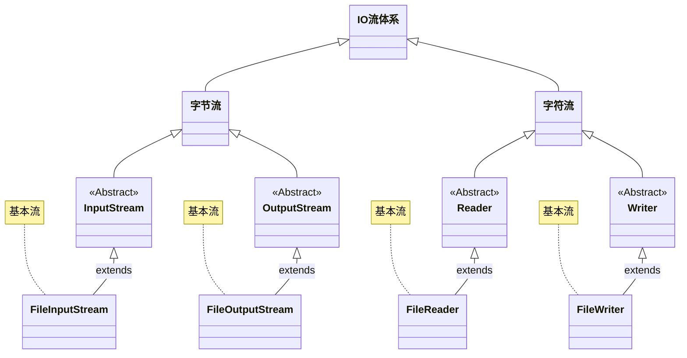
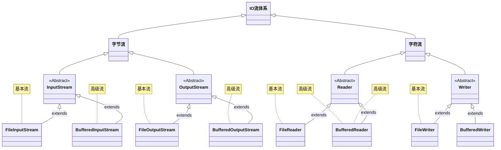
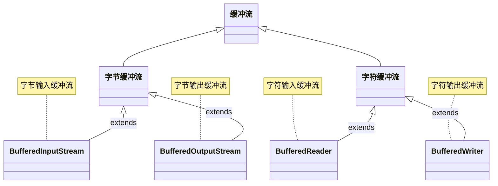

# 第一章：IO 流体系

## 1.1 概述

* 之前，我们已经学习过了 IO 流体系，如下所示：



> [!NOTE]
>
> * ① 在实际开发中，我们经常使用最下面的四个流，即：FileInputStream、FileOutputStream、FileReader 以及 FileWriter 。
> * ② 上述的四个流是 IO 流体系中最基本、最常用的流，我们也称为基本流。

## 1.2 高级流

* 高级流就是对基本流进行了一层封装，额外增加了一些新的功能，如：基本流操作效率太慢，给它们增加缓冲区。



* 字节流的基本流是没有缓冲区的，而字节流的缓冲流提供了缓冲区，所以效率提升的很明显。
* 字符流的基本流本来就有缓冲区，所以字符流的缓冲区的效率提升的并不是很明显；但是，字符流的缓冲流提供了几个好用的方法。


# 第二章：缓冲流

## 2.1 概述

* 对于字节流和字符流，Java 都提供了对应的缓冲流，每一种缓冲流又有输入和输出之分。



* 称这个四个流是高级流，是因为其需要依赖基本流，即：其是在基本流基础上增加了缓冲区。

::: code-group

```java [BufferedInputStream.java]
public class BufferedInputStream extends FilterInputStream {
    
    public BufferedInputStream(InputStream in) {
        this(in, DEFAULT_BUFFER_SIZE);
    }
    
    ...
}
```

```java [BufferedOutputStream.java]
public class BufferedOutputStream extends FilterOutputStream {
    
    public BufferedOutputStream(OutputStream out) {
        this(out, 8192);
    }
    
    ...
}
```

:::

::: code-group

```java [BufferedReader.java]
public class BufferedReader extends Reader {
    
	public BufferedReader(Reader in) {
        this(in, defaultCharBufferSize);
    }
    
    ...
}
```

```java [BufferedWriter.java]
public class BufferedWriter extends Writer {
    
    public BufferedWriter(Writer out) {
        this(out, defaultCharBufferSize);
    }
    
    ...
}
```

:::


# 第三章：转换流


# 第四章：序列化流


# 第五章：打印流


# 第六章：压缩流和解压缩流


# 第七章：常用工具包

## 7.1 概述


